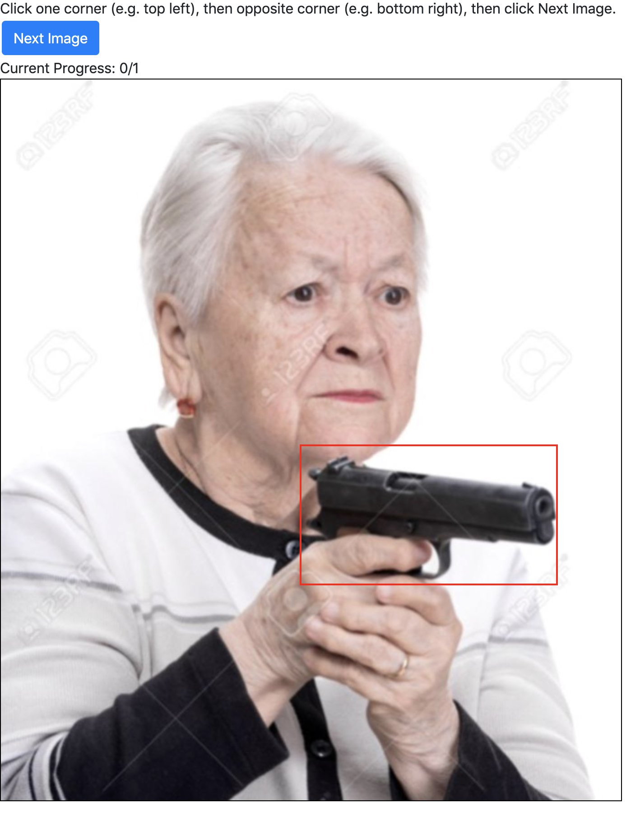

# simple_image_labeler

A very simple web app to annotate images with rectangular, unrotated bounding boxes for single-class object detection.

Careful with refresh I'm still figuring out some form resub bs

## Installation
1. Clone this repo
2. Install `flask`, `glob`, `tqdm` and `pandas`
3. `python3 main.py --dir <your image directory> [--csv <csv file to store boxes>]`
4. Go to `http://localhost:5000`
5. Click the corners of the bounding box, then click next image
6. When you're done, or if you feel like stopping, stop the server and look in `bboxes.csv` (or other specified by `--csv`)
